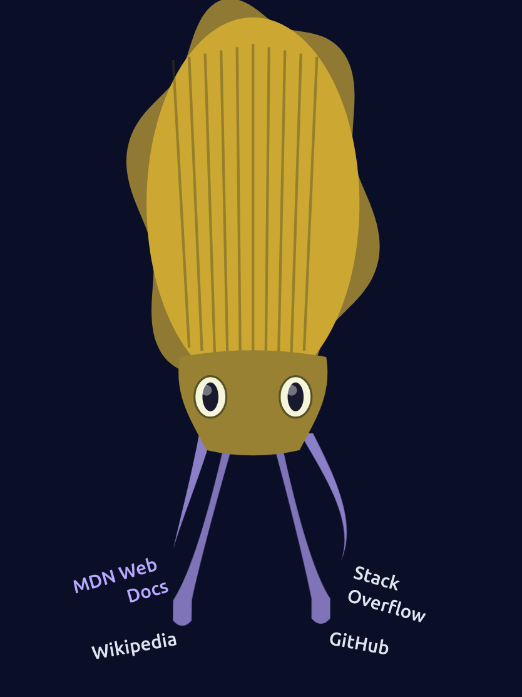

# Cuttlefish Index

An interactive, animated link directory visualized as a cuttlefish with tentacles. Each tentacle represents a website and is clickable to view more information.



## Features

- **Interactive Tentacles**: Each tentacle links to a different website
- **Smooth Animations**: Organic wave motion and colour shifting
- **Modal Dialogs**: Click tentacles to view site details before navigating
- **Fully Accessible**: Keyboard navigation, screen reader support, focus management
- **Responsive Design**: Scales beautifully on all screen sizes
- **Animation Controls**: Toggle animations on/off with a button
- **Vanilla JavaScript**: No frameworks or build tools required

## Quick Start

### Running Locally

This project requires a local HTTP server because it uses `fetch()` to load data.

```bash
# Navigate to project directory
cd cuttlefish-index

# Start Python HTTP server
python3 -m http.server 8000

# Open in browser
# Visit: http://localhost:8000
```

### Alternative Server Options

```bash
# Node.js http-server (if installed)
npx http-server -p 8000

# PHP built-in server
php -S localhost:8000

# Python 2 (legacy)
python -m SimpleHTTPServer 8000
```

Press `Ctrl+C` in the terminal to stop the server.

## Adding/Editing Sites

All website data is stored in `data/sites.json`. Edit this file to customize your cuttlefish.

### JSON Structure

```json
{
  "settings": {
    "animationEnabled": true
  },
  "sites": [
    {
      "id": "unique-id",
      "title": "Site Title",
      "url": "https://example.com",
      "description": "Description that appears in the modal.",
      "colour": "#3498db"
    }
  ]
}
```

### Field Descriptions

| Field | Required | Description |
|-------|----------|-------------|
| `id` | Yes | Unique identifier (lowercase, hyphens only) |
| `title` | Yes | Display name shown on tentacle label |
| `url` | Yes | Full URL including `https://` |
| `description` | Yes | Detailed description for modal (1-2 sentences) |
| `colour` | No | Hex colour for tentacle (defaults to purple) |

### Adding a New Site

1. Open `data/sites.json`
2. Add a new object to the `sites` array
3. Ensure all required fields are filled
4. Save the file
5. Refresh your browser

### Example

```json
{
  "id": "mysite",
  "title": "My Awesome Site",
  "url": "https://mysite.com",
  "description": "This is my personal website where I share cool projects.",
  "colour": "#ff6b6b"
}
```

## Project Structure

```
cuttlefish-index/
├── index.html          # Main HTML shell
├── css/
│   └── styles.css      # All styling including animations
├── js/
│   ├── main.js         # Entry point, initialization
│   ├── cuttlefish.js   # SVG generation for body and tentacles
│   ├── data-loader.js  # Fetches and validates sites.json
│   ├── modal.js        # Modal open/close/populate logic
│   └── animation.js    # Animation and colour shifting controls
├── data/
│   └── sites.json      # Website definitions
└── README.md           # This file
```

## Customization

### Changing Colors

Edit CSS custom properties in `css/styles.css`:

```css
:root {
    --bg-color: #0a0e27;           /* Background */
    --text-color: #e0e6f0;         /* Text */
    --tentacle-base: #8b7fc7;      /* Default tentacle color */
    --glow-color: #b8a9ff;         /* Hover glow */
}
```

### Adjusting Animation Speed

```css
:root {
    --animation-duration: 3s;      /* Wave animation speed */
    --transition-speed: 0.3s;      /* Hover transition speed */
}
```

### Modifying Cuttlefish Shape

Edit `js/cuttlefish.js`:
- `generateBody()` - Body shape, fins, eyes
- `generateTentacle()` - Tentacle curves and positioning

### Changing Modal Appearance

Edit modal styles in `css/styles.css` under `/* Modal Styles */`

## Browser Support

Tested and working in:
- Chrome/Edge (latest)
- Firefox (latest)
- Safari (latest)

Requires ES6 module support and modern CSS features.

## Accessibility Features

- **Keyboard Navigation**: Tab through tentacles, Enter/Space to activate
- **Screen Readers**: ARIA labels on all interactive elements
- **Focus Management**: Focus trapped in modal, restored on close
- **Reduced Motion**: Respects `prefers-reduced-motion` setting
- **High Contrast**: Works with high contrast modes
- **Focus Indicators**: Visible focus rings for keyboard users

### Keyboard Shortcuts

| Key | Action |
|-----|--------|
| `Tab` | Navigate between tentacles |
| `Enter` or `Space` | Open modal for focused tentacle |
| `Escape` | Close modal |
| `Tab` (in modal) | Cycle through modal controls |

## Troubleshooting

### "Failed to fetch" Error

**Cause**: Opening `index.html` directly as a file.

**Solution**: Must use HTTP server. See [Quick Start](#quick-start).

### Tentacles Not Appearing

**Check**:
1. Browser console for JavaScript errors
2. `data/sites.json` is valid JSON (use `python3 -m json.tool data/sites.json`)
3. HTTP server is running
4. Sites array has at least one valid entry

### Port Already in Use

```bash
# Find process using port 8000
lsof -ti :8000 | xargs kill -9

# Or use a different port
python3 -m http.server 8080
```

### Animation Performance Issues

- Disable animations with toggle button (bottom-right)
- Reduce number of sites
- Close other browser tabs
- Use a modern browser

### JSON Validation Error

```bash
# Validate JSON syntax
python3 -m json.tool data/sites.json

# If valid, output will be formatted JSON
# If invalid, error message shows line number
```

## Development

### Validating Code

```bash
# Check JavaScript syntax
for f in js/*.js; do
  node --check "$f" && echo "$f: OK" || echo "$f: ERRORS"
done

# Validate JSON
python3 -m json.tool data/sites.json

# Validate HTML (requires html5validator)
html5validator --root . --also-check-css
```

### Testing Checklist

- [ ] Cuttlefish renders with correct number of tentacles
- [ ] Hover shows glow effect and pauses animation
- [ ] Click opens modal with correct site info
- [ ] Modal closes: X button, click outside, Escape key
- [ ] Animation toggle button works
- [ ] Keyboard navigation works (Tab, Enter, Space)
- [ ] Responsive: resize window, cuttlefish scales
- [ ] Reduced motion: enable in OS, animations stop

## Technical Details

- **Framework**: None (vanilla JavaScript)
- **Module System**: ES6 modules
- **SVG Generation**: Programmatic via JavaScript
- **Animation**: CSS keyframes + JavaScript colour shifting
- **Styling**: CSS custom properties for theming
- **Accessibility**: WCAG 2.1 AA compliant

## License

MIT License - feel free to use and modify for your own projects!

## Credits

Created with [Claude Code](https://claude.com/claude-code)
